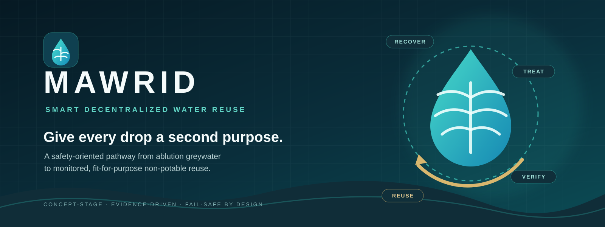
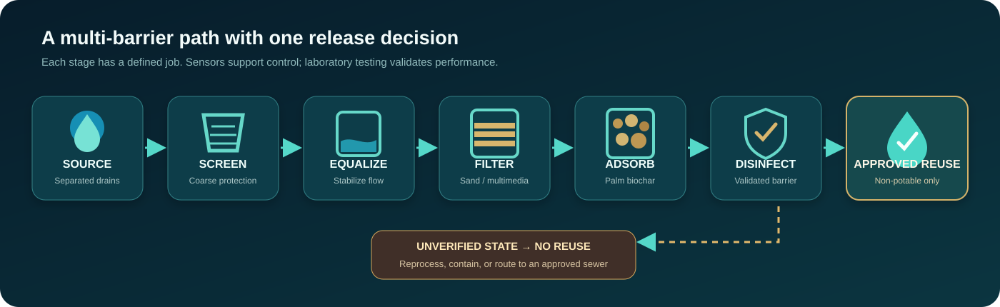
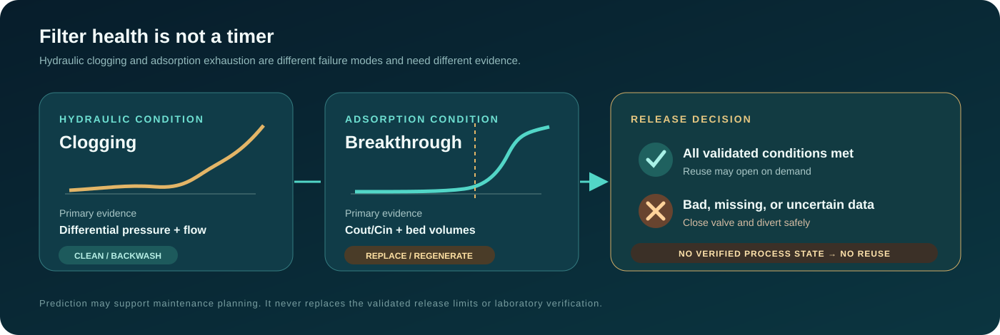
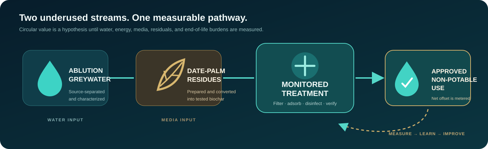

<div align="center">
  
</div>

<p align="center">
  <strong>An AI-assisted, IoT-enabled system for safe decentralized reuse of source-separated ablution greywater.</strong>
</p>

<p align="center">
  <a href="#the-challenge">Challenge</a> ·
  <a href="#the-system">System</a> ·
  <a href="#digital-intelligence">AI & IoT</a> ·
  <a href="#what-is-new">Innovation</a> ·
  <a href="#validation-plan">Validation</a> ·
  <a href="#documentation">Documentation</a>
</p>

> [!IMPORTANT]
> **Project status: concept-stage / pre-validation.** MAWRID has not yet demonstrated regulatory compliance or water safety. Performance values in this repository are prototype targets unless explicitly labeled as measured results.

> **Digital status:** the safety state machine and analytics interfaces are specified, but no trained MAWRID model is claimed. Current repository telemetry is simulated and labeled accordingly.

## The challenge

Water used for ablution and handwashing is often discharged after a single, relatively light use. In the same facility, drinking-quality water may then be used for toilet flushing or landscape irrigation.

This is a mismatch between **water quality** and **water purpose**.

MAWRID asks a focused engineering question:

> Can source-separated ablution greywater be treated locally to a defined non-potable specification, while detecting process deterioration early enough to prevent unsuitable water from reaching the reuse outlet?

## The system

**MAWRID** is a modular treatment-and-control concept for separately collected ablution and handwashing greywater. It combines accessible treatment processes with continuous operational monitoring and fail-safe diversion.

<div align="center">
  
</div>

| Stage | Purpose |
|---|---|
| Source separation | Keep low-strength greywater apart from toilet, kitchen, and industrial wastewater |
| Screening and equalization | Remove coarse solids and stabilize intermittent flow |
| Sand or multimedia filtration | Reduce suspended solids and protect downstream treatment |
| Date-palm biochar cartridge | Test adsorption of selected dissolved constituents using a local waste-derived medium |
| Controlled disinfection | Provide a validated microbial barrier after filtration |
| Online monitoring | Track loading, hydraulic condition, treatment integrity, and disinfection conditions |
| Fail-safe diversion | Block reuse when quality, sensor health, or process state cannot be trusted |

The treated water is intended only for an **approved non-potable use**. The first pilot will select one end use after confirming applicable Saudi requirements and completing a site-specific risk assessment.

## Why start with ablution water?

- It can be source-separated at centralized washing areas.
- It is generally less contaminated than mixed wastewater, although it is **not inherently safe**.
- Supply patterns and nearby non-potable demand can be measured at mosques, campuses, and public facilities.
- Treating a defined source avoids unnecessary complexity associated with blackwater or kitchen wastewater.

### V1 boundaries

| In scope | Explicitly out of scope |
|---|---|
| Ablution drainage | Toilet wastewater |
| Selected handwashing drainage | Kitchen and grease-bearing wastewater |
| Non-potable reuse after validation | Drinking or food preparation |
| A defined pilot site and end use | Reuse for ablution |
| Operational sensors plus laboratory verification | Claims that sensors detect every contaminant |

## What is new?

Greywater recycling, sand filtration, activated carbon, biochar, chlorination, and lead-lag adsorption are established ideas. Date-palm material has also been studied for water treatment. MAWRID therefore does **not** claim to have invented these components.

The proposed innovation is their integration into a locally relevant, safety-oriented operating architecture:

1. **Engineered local sorbent:** evaluate date-palm-derived biochar against commercial activated carbon under real ablution-greywater conditions.
2. **Condition-based maintenance:** track cumulative bed volumes and differential pressure instead of replacing media only on a calendar.
3. **Defined breakthrough detection:** correlate a selected online surrogate, flow history, and laboratory measurements with adsorption exhaustion.
4. **Fail-safe reuse control:** divert water whenever a critical limit, sensor-health check, or disinfection condition fails.
5. **Auditable impact:** measure water actually delivered for reuse, energy, consumables, residuals, and cost per cubic metre.

<div align="center">
  
</div>

Read the full [innovation and prior-art position](docs/innovation.md).

## Monitoring without overclaiming

Online measurements support operation; they do not replace laboratory validation.

| Measurement | Operational use | Limitation |
|---|---|---|
| Flow and cumulative volume | Quantify hydraulic loading and bed volumes | Does not indicate water quality |
| Differential pressure | Detect clogging or hydraulic deterioration | Does not indicate adsorption saturation |
| Turbidity | Observe particulate-treatment integrity | Does not prove microbial safety |
| pH and temperature | Support process and disinfection control | Not direct contaminant measurements |
| Conductivity | Detect source changes and salinity concerns | Treatment may not reduce dissolved salts |
| Free chlorine after contact | Confirm chlorination process conditions | Requires validation against microbial targets |
| UV254, if validated | Potential surrogate for selected organic breakthrough | Not a universal chemical or pathogen detector |

## Digital intelligence

MAWRID adds an explainable digital layer to the physical treatment train. IoT sensors provide time-series observations, deterministic rules protect the reuse outlet, and AI-assisted analytics may identify abnormal behaviour and maintenance needs. Online measurements and AI outputs support operation; they do not certify water safety or replace laboratory validation.

The digital layer is designed to:

- detect abnormal sensor and process behaviour;
- estimate a transparent filter-health indicator;
- flag possible sensor drift for inspection and documented calibration;
- recommend cleaning, sampling, or maintenance actions;
- evaluate remaining-useful-life prediction only after sufficient representative pilot data exist.

| Function | Primary authority |
|---|---|
| Detect an unusual multivariable pattern | Analytics or a validated AI model |
| Estimate filter condition | Transparent rules first; predictive model after validation |
| Recommend inspection or laboratory sampling | Decision-support layer |
| Evaluate a validated release limit | Deterministic safety controller |
| Close the reuse valve | Independent fail-safe controller |
| Demonstrate water quality for the selected use | Validated laboratory methods and applicable approval |

**AI never independently authorizes water reuse.** If a critical measurement is missing, stale, outside its validated range, or inconsistent with a required process condition, the reuse valve closes regardless of the model output.

Read the [AI and IoT architecture](docs/ai-and-iot-architecture.md), [data and model card](docs/data-and-model-card.md), [sensor and laboratory workflow](docs/sensor-and-lab-workflow.md), and [demo scenarios](docs/demo-scenarios.md).

## Safety by design

MAWRID uses a simple release principle:

> **No verified process state, no reuse.**

The reuse valve remains closed if a critical sensor is unavailable, calibration is expired, turbidity is outside the validated envelope, disinfection conditions are not met, or the controller loses power. Water is routed to reprocessing, containment, or an approved sewer connection.

The safety case also includes cross-connection prevention, non-potable labeling, protected make-up water, controlled storage time, sampling points, residuals management, and periodic laboratory testing. See [Safety and risk controls](docs/safety.md).

## Validation plan

The prototype is designed to answer questions, not to stage a visual-only filtration demonstration.

```text
Characterize source water
        ↓
Compare sand, raw biochar, activated biochar, and commercial carbon
        ↓
Run fixed-bed exhaustion tests and construct breakthrough curves
        ↓
Validate disinfection under representative worst-case conditions
        ↓
Inject sensor and process faults to test fail-safe diversion
        ↓
Complete a monitored pilot at one facility
```

### Provisional prototype targets

These are predeclared engineering targets, **not measured achievements or universal legal limits**.

| KPI | Prototype target | Evidence required |
|---|---:|---|
| Net water recovery | ≥ 80% over representative cycles | Calibrated inlet, reject, backwash, and reuse flow measurements |
| Filtration integrity | Effluent turbidity ≤ 2 NTU for 95% of release time and never > 5 NTU | Online readings checked against a reference method |
| Microbial treatment | ≥ 3-log reduction of the selected challenge organism | Accredited or validated microbiological method |
| Biochar breakthrough | Selected constituent remains below `Cout/Cin = 0.10` until declared breakthrough | Paired laboratory samples and a no-biochar control |
| Monitoring availability | ≥ 95% valid data availability | Calibration and missing-data records |
| Fail-safe response | 100% successful diversion in declared fault tests | Logged high-turbidity, low-disinfectant, sensor-loss, communication-loss, and power-loss tests |

Final release criteria will be determined by the selected end use, risk assessment, current Saudi requirements, and laboratory validation. The complete protocol is in [Experimental validation](docs/validation.md).

## Circular value, measured honestly

<div align="center">
  
</div>

MAWRID links two underused streams: lightly contaminated water and date-palm residues. The environmental claim remains conditional until the project measures feedstock preparation, pyrolysis or activation, transport, pumping, disinfectant use, backwash, regeneration, and end-of-life handling.

The primary impact metric is:

```text
Net water offset
= treated water actually delivered and used
− potable make-up
− treatment and backwash losses
```

## Pilot concept

The preferred first deployment is a mosque or university building with a centralized ablution area, accessible source-separation plumbing, and measurable nearby non-potable demand.

| Pilot element | Initial approach |
|---|---|
| Capacity | Bench system first; then a site-specific `1–5 m³/day` pilot |
| End use | One approved low-exposure use selected after risk and regulatory review |
| Comparison | Date-palm biochar, activated date-palm biochar, and commercial activated carbon |
| Measurements | Flow, bed volumes, turbidity, pH, conductivity, pressure drop, disinfectant condition, energy, and laboratory water quality |
| Decision | Advance only if treatment, safety, operability, and cost evidence meet predeclared criteria |

## Documentation

| Document | Purpose |
|---|---|
| [System design](docs/system-design.md) | Treatment train, instrumentation, operating states, and modular architecture |
| [Scientific basis](docs/scientific-basis.md) | Fit-for-purpose treatment, biochar role, and measurement boundaries |
| [Innovation and prior art](docs/innovation.md) | Defensible novelty, competing approaches, and claims we avoid |
| [Experimental validation](docs/validation.md) | Test matrix, sampling, breakthrough testing, and acceptance logic |
| [Safety and risk controls](docs/safety.md) | Hazards, barriers, fail-safe rules, and residuals handling |
| [Impact and economics](docs/impact-and-economics.md) | Water balance, CAPEX/OPEX framework, and sustainability accounting |
| [Roadmap](docs/roadmap.md) | Path from bench evidence to monitored deployment |
| [AI and IoT architecture](docs/ai-and-iot-architecture.md) | Edge, data, analytics, safety, and communications boundaries |
| [Data and model card](docs/data-and-model-card.md) | Intended model use, evidence status, evaluation, and limitations |
| [Sensor and laboratory workflow](docs/sensor-and-lab-workflow.md) | Traceable reconciliation of online and laboratory measurements |
| [Demo scenarios](docs/demo-scenarios.md) | Reproducible normal, degradation, and fail-safe demonstrations |
| [References](references/README.md) | Curated official, scientific, and standards-based sources |

## Evidence labels

Every technical statement and future dataset should use one of these labels:

| Label | Meaning |
|---|---|
| **LITERATURE** | Reported by an external source; not a MAWRID result |
| **TARGET** | A predeclared prototype acceptance criterion |
| **RESULT** | A MAWRID measurement linked to method and raw data |
| **ILLUSTRATIVE** | An example used only to explain a calculation or interface |
| **NOT TESTED** | An important claim awaiting evidence |

## Team and track

MAWRID is being developed for a water-innovation hackathon. Team names, roles, institutional affiliation, challenge track, demo video, and pitch deck will be added before submission.

## Responsible use

This repository documents a research and engineering concept. It is not construction guidance, a water-safety certification, or authorization to install a reuse system. Any deployment requires qualified engineering review, site-specific risk assessment, laboratory validation, current regulatory approval, and safe plumbing practices.

## Citation

If you reference this project, use the metadata in [`CITATION.cff`](CITATION.cff).

---

<p align="center">
  <strong>MAWRID</strong><br>
  Give every drop a second purpose.
</p>
