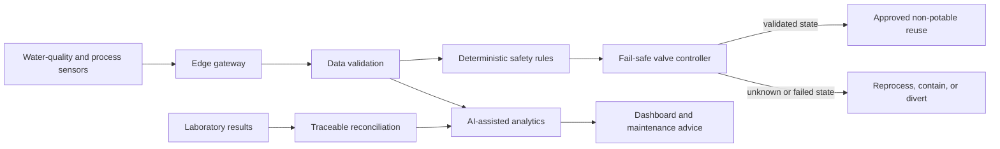

# AI and IoT Architecture

> **Status:** Proposed architecture. The deterministic state machine can be prototyped before a predictive model is trained. No AI performance result is claimed.

## Design principle

MAWRID separates decision support from safety authority:

> AI predicts and explains. Validated rules protect the reuse outlet.

The architecture must remain safe if the model, network, dashboard, cloud service, or a non-critical sensor fails.

## Functional architecture

## Edge layer

The bench prototype may use an ESP32-class gateway. A field pilot should select industrial hardware after a hazard and reliability review.

The edge layer should:

- timestamp and validate every reading;
- reject impossible, stale, or malformed values;
- calculate differential pressure and cumulative bed volumes;
- retain a local event buffer during network loss;
- execute the safety state machine locally;
- drive the diversion valve without depending on cloud connectivity.

## Data layer

Every observation should carry a sensor identifier, unit, timestamp, calibration status, quality flag, and evidence label. Laboratory records must preserve sample identity, collection time, method, result, unit, detection limit, and quality-control status.

The initial implementation can use CSV or a small local database. A pilot may use MQTT for telemetry and a time-series database, subject to cybersecurity and data-governance review.

## Analytics layer

### Transparent baseline

The first release should use auditable rules:

- rising differential pressure with falling flow suggests hydraulic clogging;
- rising outlet turbidity suggests loss of filtration integrity;
- a flat-lined or implausibly discontinuous signal suggests a sensor fault;
- repeated sensor-to-laboratory disagreement suggests possible drift;
- missing critical data forces a non-reuse state.

### Candidate AI functions

1. **Anomaly detection:** identify multivariable patterns that differ from validated normal operation.
2. **Filter-health estimation:** combine hydraulic loading, differential pressure, flow, and treatment indicators into an explainable condition estimate.
3. **Maintenance forecasting:** estimate a maintenance window only after multiple representative filter-life datasets are available.

Models must be compared with the transparent baseline. A more complex model advances only if it improves prospective performance without weakening safety or interpretability.

## Safety boundary

AI outputs are advisory. They may trigger inspection, sampling, cleaning, or maintenance recommendations. They must not:

- certify microbial or chemical safety;
- override a failed release criterion;
- open the reuse valve;
- silently change a sensor calibration;
- infer a safe state from the last valid reading.

## Cybersecurity and resilience

- Keep safety control local and independent of the public internet.
- Authenticate devices and restrict configuration changes.
- Encrypt remote communications where deployed.
- Log model versions, configuration changes, overrides, and alarms.
- Define safe behaviour for power, network, storage, and clock failures.
- Require human authorization for calibration changes and model deployment.

## Minimum hackathon implementation

- One edge gateway or a faithful hardware emulator.
- Flow, turbidity, and differential-pressure inputs.
- A local safety state machine connected to a visible valve or relay.
- A dashboard that shows current state, evidence label, alarms, and explanations.
- Reproducible normal, degradation, sensor-loss, and high-turbidity scenarios.
- Simulated data clearly labeled `SIMULATED`, with no claim of measured treatment performance.
